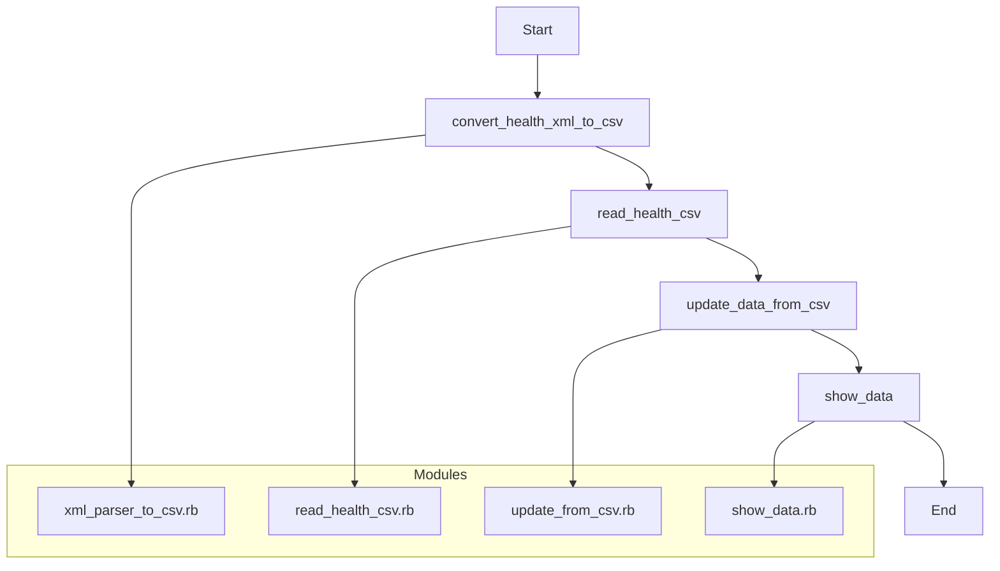

Apple Health Data Analyzer (Ruby)
'''For understanding ruby'''

Data Analyzed:
The program focuses on the following key health metrics:

Step Count
Burned Energy
Flights Climbed
Headphone Volume
Walking Speed
Step Length

How to Use:
Export Your Data: Export your health data from the Apple Health app to an XML file.

Place XML File: Put the exported XML file (e.g., export.xml) into the ./xml directory of this project.

Install Dependencies:
Ensure you have Ruby installed.
If specific Ruby gems are required (e.g., rexml, csv), you might need to install them. (It's recommended to include a Gemfile if external gems are used.)

Execute the Ruby Script:
Open your terminal in the project's root directory.
Run ruby main.rb.
(Note: If your exported data file is not named "export.xml", you will need to modify main.rb to specify the correct filename, or rename your file to export.xml.)

Visualize Your Data (using Python):
A health_summary.csv file will be generated in the project root.
You can then use the Python scripts located in the src/analysis directory to visualize your processed data. These scripts typically leverage libraries like pandas, matplotlib, and seaborn to create various charts

